#### A REPORT ON

> **"ONLINE LABOUR HIRING SYSTEM"**
>
> MAHARASHTRA STATE BOARD OF TECHNICAL EDUCATION MUMBAI THE PARTIAL
> FULFILLMENT OF THE REQUIREMENTS FOR THE AWARD OF THE DIPLOMA
>
> OF

#### **DIPLOMA IN CIVIL ENGINEERING**

> SUBMITTED BY

+-----+---------------------------+---------------+
| Mr. | Thete Yash Anil           | (23651230117) |
+=====+===========================+===============+
| Mr. | > Manjare Shruti Bhima    | (23651230106) |
+-----+---------------------------+---------------+
| Ms. | > Ahire Harshada Sahebrao | (24651230350) |
+-----+---------------------------+---------------+
| Ms. | > Raut Ritesh Dnyaneshwar | (23651230112) |
+-----+---------------------------+---------------+

> **GUIDED BY**


> **DEPARTMENT OF COMPUTER ENGINEERING**

#### **SND POLYTECHNIC BABHULGAON,**

> YEOLA, NASHIK- 423401
>
> MAHARASHTRA STATE BOARD OF TECHNICAL EDUCATION MUMBAI 2024-25
>
> 
>
> **CERTIFICATE**
>
> This is to certify that project work entitled **"Online Labour hiring
> System"** Submitted by

+-----+---------------------------+---------------+
| Mr. | Thete Yash Anil           | (23651230117) |
+=====+===========================+===============+
| Mr. | > Manjare Shruti Bhima    | (23651230106) |
+-----+---------------------------+---------------+
| Ms. | > Ahire Harshada Sahebrao | (24651230350) |
+-----+---------------------------+---------------+
| Ms. | > Raut Ritesh Dnyaneshwar | (23651230112) |
+-----+---------------------------+---------------+

####  **(Miss. Bharud.S.P) (Prof.Gandole V.A)**

> Project Guide HOD, Civil Engineering

####  **(Prof.Gandole V.A) (Prof. Jadhav U.B)**

Project Co-ordinator (Principal)

> **\...\...\...\...\...\...\...\...\...
> \...\...\...\...\...\...\...\...\...**

#### Internal Examiner External Examiner

#### 

> **ACKNOWLEDGEMENT**
>
> It gives us great pleasure in presenting the preliminary project
> report on 'Online Labour hiring System'
>
> We would like to take this opportunity to thank our internal guide
> (Miss.Bharud.S.P)
>
> Coordinator Prof.Gandole V.A for giving us all the help and guidance
> we needed. So really grateful to him for their kind support. Their
> valuable suggestions were very helpful.
>
> Beside, we are thankful to management and Prof. Jadhav U.B., Principal
> of our
>
> college.
>
> We are thankful to our family members for supporting and encouraging
> us and for providing their guidance for our project.
>
> In the end, our thanks to all friends and colleagues for providing
> their useful suggestions, which contributed greatly in making our
> project successful.

Mr. Thete Yash Anil (23651230117)

Ms.Manjare Shruti Bhima (23651230106)

Ms. Ahire Harshada Sahebrao (24651230350)

Mr.Raut Ritesh Dnyaneshwar (23651230112)

> **ABSTRACT**
>
> The Online Labour Hiring System is an innovative web based platform
> designed to streamline the process of hiring qualified and verified
> labour workforce. Traditional hiring methods are often time
> consuming, lack transparency, and involve extensive manual efforts.
> This system leverages modern technology to connect clients with
> labourers through an intuitive interface that supports secure
> registration, profile verification, and real-time communication.
> Clients can view worker profiles, check ratings, and make informed
> decisions, while workers can find suitable job opportunities based on
> their skills and availability. The system enhances efficiency,
> promotes reliability, and ensures account- ability in the hiring process.
> It is particularly useful for residential societies, commercial
> buildings, event organizers, and institutions seeking trusted labour
> services.
>
> **Keywords** :Labour Labour Hiring System, Web-based Application,
> Real-time Communication, Reliability and Monitoring, Worker Verification,
> Digital Labour Solutions.
>
> **Contents**

+------------------------------------------------------+--------------+
| > **TITLE PAGE**                                     | **i**        |
| >                                                    |              |
| > **CERTIFICATE ACKNOWLEDG**                         | > **i i ii** |
|                                                      |              |
| **ABSTRACT**                                         |              |
+======================================================+==============+
| > **1 INTRODUCTION**                                 | > **1**      |
+------------------------------------------------------+--------------+
| 1.1 Overview . . . . . . . . . . . . . . . . . . . . | > 1          |
| . . . . . . . . . . . . . . . . .                    |              |
+------------------------------------------------------+--------------+
| 1.2 Motivation . . . . . . . . . . . . . . . . . . . | > 2          |
| . . . . . . . . . . . . . . . . .                    |              |
+------------------------------------------------------+--------------+
| 1.3 Problem Statement . . . . . . . . . . . . . . .  | > 3          |
| . . . . . . . . . . . . . . . .                      |              |
+------------------------------------------------------+--------------+
| > **2 LITERATURE SURVEY**                            | > **4**      |
+------------------------------------------------------+--------------+
| 2.1 Literature Papers . . . . . . . . . . . . . . .  | > 4          |
| . . . . . . . . . . . . . . . . .                    |              |
+------------------------------------------------------+--------------+
| 2.2 Limitation of Literature Survey . . . . . . . .  | > 6          |
| . . . . . . . . . . . . . . . .                      |              |
+------------------------------------------------------+--------------+
| > **3 SOFTWARE REQUIREMENT SPECIFICATION**           | > **7**      |
+------------------------------------------------------+--------------+
| 3.1 Introduction . . . . . . . . . . . . . . . . . . | > 7          |
| . . . . . . . . . . . . . . . . .                    |              |
+------------------------------------------------------+--------------+
| 3.1.1 Project Scope . . . . . . . . . . . . . . . .  | > 8          |
| . . . . . . . . . . . . . .                          |              |
+------------------------------------------------------+--------------+
| 3.1.2 User classes and characteristics . . . . . . . | > 8          |
| . . . . . . . . . . . . .                            |              |
+------------------------------------------------------+--------------+
| 3.1.3 Assumptions and Dependencies . . . . . . . . . | > 8          |
| . . . . . . . . . . .                                |              |
+------------------------------------------------------+--------------+
| 3.2 Functional Requirements . . . . . . . . . . . .  | > 10         |
| . . . . . . . . . . . . . . . .                      |              |
+------------------------------------------------------+--------------+
| 3.2.1 System Interface . . . . . . . . . . . . . . . | > 11         |
| . . . . . . . . . . . . .                            |              |
+------------------------------------------------------+--------------+
| 3.3 Evternal Interface Requirement . . . . . . . . . | > 12         |
| . . . . . . . . . . . . . . .                        |              |
+------------------------------------------------------+--------------+
| 3.3.1 User Interfaces . . . . . . . . . . . . . . .  | > 12         |
| . . . . . . . . . . . . . .                          |              |
+------------------------------------------------------+--------------+
| 3.3.2 Communication Interfaces . . . . . . . . . . . | > 12         |
| . . . . . . . . . . . .                              |              |
+------------------------------------------------------+--------------+
| 3.3.3 Software Quality Attributes . . . . . . . . .  | > 12         |
| . . . . . . . . . . . . .                            |              |
+------------------------------------------------------+--------------+
| 3.4 User Interfaces . . . . . . . . . . . . . . . .  | > 13         |
| . . . . . . . . . . . . . . . . .                    |              |
+------------------------------------------------------+--------------+
| 3.4.1 Six Usability Goals . . . . . . . . . . . . .  | > 13         |
| . . . . . . . . . . . . . .                          |              |
+------------------------------------------------------+--------------+
| 3.5 Nonfunctional Requirement . . . . . . . . . . .  | > 14         |
| . . . . . . . . . . . . . . .                        |              |
+------------------------------------------------------+--------------+

+-------+----------+-----------------------------------------+------+
|       | > 3.5.1  | Usability: . . . . . . . . . . . . . .  | > 14 |
|       |          | . . . . . . . . . . . . . . . . . .     |      |
+=======+==========+=========================================+======+
|       | > 3.5.2  | Reliability: . . . . . . . . . . . . .  | > 14 |
|       |          | . . . . . . . . . . . . . . . . . . .   |      |
+-------+----------+-----------------------------------------+------+
|       | > 3.5.3  | Performance: . . . . . . . . . . . . .  | > 14 |
|       |          | . . . . . . . . . . . . . . . . .       |      |
+-------+----------+-----------------------------------------+------+
|       | > 3.5.4  | Scalability: . . . . . . . . . . . . .  | > 14 |
|       |          | . . . . . . . . . . . . . . . . . .     |      |
+-------+----------+-----------------------------------------+------+
|       | > 3.5.5  | Open standard: . . . . . . . . . . . .  | > 14 |
|       |          | . . . . . . . . . . . . . . . .         |      |
+-------+----------+-----------------------------------------+------+
| > 3.6 | > System | Requirements . . . . . . . . . . . . .  | > 15 |
|       |          | . . . . . . . . . . . . . . . . .       |      |
+-------+----------+-----------------------------------------+------+
|       | > 3.6.1  | Database Requirements . . . . . . . . . | > 15 |
|       |          | . . . . . . . . . . . . . . . .         |      |
+-------+----------+-----------------------------------------+------+
|       | > 3.6.2  | Database . . . . . . . . . . . . . . .  | > 15 |
|       |          | . . . . . . . . . . . . . . . . .       |      |
+-------+----------+-----------------------------------------+------+
|       | > 3.6.3  | Software Requirements(Platform Choice)  | > 16 |
|       |          | . . . . . . . . . . . . . . .           |      |
+-------+----------+-----------------------------------------+------+
|       | > 3.6.4  | Development Tools . . . . . . . . . . . | > 16 |
|       |          | . . . . . . . . . . . . . . . .         |      |
+-------+----------+-----------------------------------------+------+
|       | > 3.6.5  | Programming Language . . . . . . . . .  | > 17 |
|       |          | . . . . . . . . . . . . . . .           |      |
+-------+----------+-----------------------------------------+------+
|       | > 3.6.6  | Framework . . . . . . . . . . . . . . . | > 18 |
|       |          | . . . . . . . . . . . . . . . .         |      |
+-------+----------+-----------------------------------------+------+
|       | > 3.6.7  | Hardware Requirements . . . . . . . . . | > 19 |
|       |          | . . . . . . . . . . . . . . .           |      |
+-------+----------+-----------------------------------------+------+

> [3.7 Anslysis Model: SDLC Model 20](#anslysis-model-sdlc-model)

4.  SYSTEM DESIGN 22

    1.  [System Architecture 22](#system-architecture)

    2.  [System Architecture Description
        23](#system-architecture-description)

    3.  [Details of each module 23](#details-of-each-module)

    4.  [Data Flow Diagrams 25](#data-flow-diagrams)

    5.  [ER Diagrams 28](#er-diagrams)

    6.  [UML Diagram 29](#uml-diagram)

        1.  [Activity Diagram 29](#activity-diagram)

        2.  [Sequence Diagram 31](#sequence-diagram)

        3.  [Use Case Diagram 32](#use-case-diagram)

        4.  [Class Diagram 34](#class-diagram)

5.  EXPERIMENTAL CONFIGURATION 36

    1.  [Tools and Technology used 36](#tools-and-technology-used)

6.  SOFTWARE TESTING 37

    1.  [Introduction 37](#introduction)

    2.  [Types of Testing 37](#types-of-testing)

        1.  [Manual Testing 38](#manual-testing)

        2.  [Automated Testing 38](#automated-testing)

        3.  [Unit Testing 38](#unit-testing)

        4.  [Integration Testing 38](#integration-testing)

        5.  [Regression Testing 39](#regression-testing)

    3.  [Software testing 39](#software-testing)

    4.  [Black Box Testing 40](#black-box-testing)

        1.  [Black-box 40](#black-box)

    5.  [White Box Testing 42](#white-box-testing)

        1.  [White-box 42](#white-box)

    6.  [Test cases 44](#test-cases)

    7.  [Test Results 45](#test-results)

7.  EXPERIMENTAL RESULTS 46

    1.  [Screen shots 46](#screen-shots)

8.  OTHER SPECIFICATION 53

    1.  [Advantages 53](#advantages)

    2.  [Applications 54](#applications)

9.  CONCLUSION 55

> REFERENCES 55

1.  [Relevant Mathematics associated with the Project
    57](#relevant-mathematics-associated-with-the-project)

> [Appendix B 60](#appendix-b)
>
> **List of Figures**

1.  SQLite Database 15

2.  Python software programming language 16

3.  VS Code programming language 17

4.  SDLC Model 20

```{=html}
<!-- -->
```
1.  System Architecture Diagram of Project 22

2.  DFD 0 Diagram 25

3.  DFD 1 Diagram 26

4.  DFD 2 Diagram 27

5.  ER Diagram 28

6.  Activity Diagram of e-Tendering System 30

7.  Sequence Diagram 31

8.  Usecase Diagram 33

9.  Class diagram 35

> **List of Tables**

1.  Test cases 44

> 6.3 Test Results 45

**Chapter 1**

> **INTRODUCTION**

1.  **Overview**

> In today's fast-paced and labour-conscious world, the demand for
> trustworthy and efficient labour workforce has become more critical
> than ever. Traditional methods of hiring labourers are often
> time-consuming, lack transparency, and may not provide sufficient
> verification of credentials. To address these challenges, the Online
> Labour Hiring System offers a modern solution that leverages
> technology to streamline the recruitment and management of labour
> services. This web-based platform connects users directly with
> verified labourers, offering features such as worker profiles,
> background checks, service scheduling, real-time communication, and
> feedback systems. The system aims to enhance productivity by making the
> process of hiring labour more accessible, efficient, and reliable for
> homes, offices, institutions, and events.
>
> In today's rapidly evolving digital age, ensuring workplace efficiency and
> labour remains a significant concern for individuals, organizations,
> and institutions alike. The increasing rate of labour shortages has
> highlighted the need for a reliable and efficient method of sourcing
> professional labour personnel. Traditionally, hiring labour involves
> manual processes, word-of-mouth referrals, or agencies that may not
> always provide transparency in qualifications, experience, or
> background verification. These limitations can lead to inefficient
> hiring, availability issues, and inconvenience.To overcome these challenges,
> the Online Labour Hiring System provides a comprehensive,
> user-friendly digital platform that connects clients with certified
> and verified labour workforce. This system enables users to browse
> worker profiles, check credentials, view experience, read reviews, and
> book services according to their specific needs. Whether for
> residential buildings, commercial properties, events, or institutions,
> the plat- form simplifies and secures the hiring process through
> automation and centralized data access. The platform not only benefits
> those seeking labour services but also empowers workers by offering
> them visibility, direct job opportunities, and schedule management
>
> tools. Through integration with location services, availability
> filters, and secure payment gateways, the system ensures an efficient,
> transparent, and trustworthy environment for both parties. Ultimately,
> this project bridges the gap between service providers and seekers in
> the labour domain, revolutionizing traditional hiring methods with
> the power of technology.

2.  **Motivation**

> The motivation behind developing the Online Labour Hiring System stems
> from the growing need for reliable and streamlined services in today's
> society. With rising concerns over personal reliability, theft, and
> unauthorized access in both residential and commercial areas, the
> demand for professional labour is steadily increasing. However, the
> traditional approach to hiring labour through physical agencies or
> informal references is often inefficient, lacks proper verification,
> and can be time consuming.
>
> Many clients face challenges such as not knowing the background or
> experience of the labours, difficulty in comparing service providers,
> and limited access to emergency support. On the other hand,labour
> personnel often struggle to find suitable jobs due to the lack of an
> organized platform to showcase their skills and availability.
>
> This project is motivated by the desire to solve these problems
> through a digital platform that offers convenience, transparency, and
> accessibility. By creating a system where clients can find, evaluate,
> and hire verified labours online and where labours can manage their
> profiles and job opportunities we aim to improve the labour hiring
> process and contribute to a better and more efficient society.

3.  **Problem Statement**

> In the current labour services industry, the process of hiring labours
> is often manual, unorganized, and lacks transparency. Clients usually
> rely on third party agencies, classifieds, or word of mouth references
> to hire labour, which can result in unverified personnel, inefficient
> service, and reliability concerns. There is no centralized, user-friendly
> platform that allows clients to search, compare, and hire workers based
> on verified credentials, experience, availability, or reviews.
>
> Similarly, labours face challenges in finding consistent work
> opportunities, show casing their qualifications, or managing their job
> schedules effectively. This leads to a gap in communication and trust
> between clients and service providers.
>
> To address these issues, there is a need for a digital platform that
> can streamline the hiring process, ensure proper verification, and
> provide real time communication between workers and clients. The Online
> Labour Hiring System aims to fill this gap by offering a secure,
> efficient, and accessible solution for both parties.
>
> **Chapter 2**
>
> **LITERATURE SURVEY**
>
> In this chapter we will see the various studies and research conducted
> in order to identify the current scenarios and trends.

1.  **Literature Papers**

#### "Mobile and Web-Based Labourer Working, Monitoring and Re- porting System to Maintain Efficient and Productive Environment at Premises Author:V.R. Gannapathy

> The worker tour system helps companies and organizations to monitor
> their labour activities such as assisting people, buildings,
> assets, or equipment. According to the existing system, the working
> at each checkpoint is being executed by using RFID-based digital data
> loggers that records and save all working entries internally. The
> data will be transferred manually by the worker once the working is
> completed. In some cases, when there is a problem with the device, the
> system unable to retrieve the working data that has been already
> stored in the device. In addition, the current system also not be able
> to track the worker's movement, pa- trolling information, and incidents
> in real-time basis. The developed Labourer Working,
> Monitoring and Reporting (eSmartWorker) system is able incorporates
> many unique and intelligent technologies such as NFC, GPS and IoT to
> records and save the working data automatically on the cloud/server
> in real-time basis. An important value-added feature of the system is
> real-time incidents notification that able to notify any risk of the
> workers instantly to the in-charged contractor.Further more,
> through the eSmartWorker, the working information such as time,
> date, GPS coordinate, worker ID can be monitored and retrieved remotely
> via proposed Mobile Apps and Web at a convenient time. The eSmartWorker
> working system is proposed to improve the operational efficiency of the people and
> assets by assisting the labourers to perform their working
> duty efficiently.\[1\]

4

#### "Event Management Systems (EMS)" Author: Drahsti Amrish Shah

> This study aims to develop an Event Management Systems (EMS), a
> web-based application that makes use of a digital event management
> planning system. EMS enables the customers to organise events on a
> single console, removing the need to travel to a different console and
> therefore making the process more convenient. There are four
> strategies to conduct the research which are technical research, EMS
> development, mixed method data collection, and data analysis. In
> addition, this study also presented the system architecture, project
> plan and implementation of the EMS. Then, the EMS has been tested by 2
> users in both client and admin side. Keywords-Event Management
> Systems, mixed method, system architecture, project plan, web-based
> application.\[2\]

#### "Event Management Author: Author:Vinay Mishra

> Online event management system is an online event management system
> software project that serves the functionality of an event manager.
> The system allow only registered user login and new user are allowed
> to register on the application .This proposed to be a web application.
> The project provides most of the basic function- ality required for an
> event type e.g. \[marriage, Dance Show birthday party, etc.\], the
> system then allows the user to select date and time of event, place
> and the event equipment. All the data is logged in the database and
> the user is given a receipt number for his booking. The data is then
> send to administrator (website owner) and they may interact with the
> client as per his requirement.\[3\]

#### "Web-Based College Event Management Platform"

#### Author: Bhagyashree Patil, Shruti Rawool, Ayushi Sagar, Prof.Sudhakar Yerme

> The Web-Based College Event Management Platform (WEMP) is a powerful
> web- based application designed to streamline event planning and
> coordination in educational institutions. The WEMP leverages
> cutting-edge technologies like Node.js, MongoDB, and more. With WEMP,
> you can create, plan, and track events with minimal administrative
> overhead. The easy-to-use interface allows you to manage events from
> registration to post-event feedback. MongoDB's data model is flexible
> and provides scalability as your college community grows. With
> Node.js, you can communicate in real time, providing instant
> notifications and updates to event organizers and attendees. The WEMP
> also has strong authentication and authorization mechanisms to assist
> sensitive data. Combining the power of Node.js with Mon-

1.  **Limitation of Literature Survey**

-   Costing

-   Technology Complexity

-   Time Consuming Feature

-   Not Easy to Understand

> **Chapter 3**
>
> **SOFTWARE REQUIREMENT SPECIFICATION**

1.  **Introduction**

> The Online Labour Hiring System is a web based application designed to
> simplify the process of hiring labour personnel. It provides a
> platform where clients can search, view, and hire verified labour, and
> where labour can register, manage their profiles, and find job
> opportunities. The purpose of this document is to define the software
> requirements for the Online Labour Hiring System. It outlines the
> system's functionality, design constraints, external interfaces, and
> performance requirements to ensure a well-defined and scalable
> product.
>
> 7

1.  **Project Scope**

> This system allows clients to search for and hire certified labour via
> a web platform. Labour personnel can register, upload documentation,
> and receive job offers. The platform includes user authentication,
> profile management, real time booking, rating and review systems, and
> administrative controls. It aims to simplify, secure, and modernize
> the hiring process.

2.  **User classes and characteristics**

    1.  Clients are individuals or organizations who require labour
        services. They typically have minimal technical expertise, so
        the interface designed for them is intuitive and user friendly.
        Clients can register, log in, search for labour based on various
        filters (such as location, availability, and experience), view
        profiles, book workers, and provide ratings or feedback after
        service completion.

    2.  Labour are professionals offering their services on the
        platform. They require features that allow them to create and
        manage detailed profiles, update availability, respond to job
        requests, and view their job history. Most labour may have basic
        technical skills, so the system ensures that profile management
        and job interaction are straight forward and accessible even on
        mobile devices.

    3.  Administrators oversee the entire platform, ensuring the
        authenticity and smooth operation of the system. They verify the
        documents and credentials submitted by labour, handle user
        disputes, monitor bookings, and manage system settings. Ad-
        ministrators are assumed to be technically proficient and are
        provided with advanced controls and dashboards for managing both
        clients and labour efficiently.

> This user classification ensures that the system addresses the
> specific needs of each group while maintaining usability, and
> operational efficiency across the platform.

3.  **Assumptions and Dependencies**

    1.  Internet Connectivity: It is assumed that all users (clients,
        labours, and administrators) have access to a stable internet
        connection, as the platform is webbased and relies on realtime
        interactions.

    2.  Device Accessibility: Users will access the platform using
        internet enabled devices such as smartphones, tablets, or
        computers with modern web browsers.

    3.  User Compliance: Labour are expected to provide valid and
        truthful documentation for identity verification, background
        checks, and certification before being approved to accept job
        requests.

    4.  Admin Oversight: It is assumed that the system will always have
        active administrators responsible for reviewing labour
        applications, managing user issues, and overseeing daily
        operations to maintain platform integrity.

    5.  Third-party Services: The system may rely on third party APIs
        for functionalities such as SMS/email notifications (e.g.,
        Twilio, SMTP), map services (e.g., Google Maps API), or payment
        gateways (for future enhancements). The availability and
        functionality of these services are beyond the direct control of
        the system.

    6.  Data security Measures: The platform assumes that proper data
        encryption and secure coding practices will be implemented to
        assist user data and prevent unauthorized access or breaches.

    7.  Legal and Regulatory Compliance: It is assumed that all user
        data will be handled in compliance with data privacy laws
        such as GDPR or local data privacy policies.

    8.  System Maintenance: Periodic maintenance and updates are assumed
        to ensure the system remains secure, bug free, and compatible
        with evolving technologies.

```{=html}
<!-- -->
```
2.  **Functional Requirements**

> The Labour System is designed to provide a secure, efficient, and
> automated access control solution for restricted areas. The following
> functional requirements define the system's key capabilities:

-   User Registration and Login:

> The system shall allow clients and labour to register using an email
> ID, phone number, and password. The system shall validate credentials
> and allow secure login for registered users.

-   User Role Management:

> The system shall differentiate between clients, labour, and
> administrators, providing access to features based on user roles.

-   Profile Creation and Management:

> Labour shall be able to create and update their profiles, including
> name, contact details, experience, ID proof, certifications, and
> availability.
>
> Clients shall have profiles that store their contact details, job
> history, and feedback given.

-   Search and Filter Workers:

> Clients shall be able to search for labour based on filters such as
> location, availability, rating, language, or years of experience.

-   Booking System:

> The system shall allow clients to book labour for specific time slots
> and dates. Bookings shall generate notifications for labour and update
> their availability status.

-   Notification System:

> The system shall send realtime notifications to labour and clients via
> email or SMS when a booking is made, modified, or canceled.

-   Document Upload and Verification:

> Labour shall upload verification documents, which shall be reviewed
> and approved by the administrator before the profile goes live.

1.  **System Interface**

    1.  Secure system

    2.  Database requirement

    3.  Notification to user

```{=html}
<!-- -->
```
1.  **Evternal Interface Requirement**

    1.  **User Interfaces**

> User has to interface with system to access the features and to
> provide easy communication with system.

2.  **Communication Interfaces**

> There is a specific network protocol as long as the performance
> requirement are satisfied.

3.  **Software Quality Attributes**

> Software testing is a critical element of software quality assurance
> and represents the ultimate review of specification, design and
> coding. In fact, testing is the one step in the software engineering
> process that could be viewed as destructive rather than constructive.
> A strategy for software testing integrates software test case design
> methods into a well-planned series of steps that result in the
> successful construction of software. Testing is the set of activities
> that can be planned in advance and conducted systematically. The
> underlying motivation of program testing is to affirm software quality
> with methods that can economically and effectively apply to both
> strategic to both large and small scale systems.

2.  **User Interfaces**

> The user experience should be considered as priority in user
> interface. This is the way that the product will be used by users.
> Users should meet the exact needs they want, without confuse. Designer
> should clear the primary objective of developing an interactive
> product. It is suggested to classify the objectives in terms of
> usability and user experience goals. There are six goals of usability.
> They could make the product easy to learn and effective to use.

1.  **Six Usability Goals**

    1.  Effective to use(effectiveness)

    2.  Efficient to use(efficiency)

    3.  Reliable to use(reliability)

    4.  Having good utility(utility)

    5.  Easy to learn(learnability)

    6.  Easy to remember how to use(memorability)

> Effectiveness is a common goal to reach the best result of the
> expectation. The performance of the software is satisfactory.
> Efficiency is focus on the cost of computation of the software. Most
> users make an attention on the speed of software, they think every
> action should be fluent. If a lag accrued during the operation, people
> will think there are some problems with it. It will worsen the user
> experience.

3.  **Nonfunctional Requirement**

    1.  **Usability:**

> The ease with which the system can be learned, managed or used.
> Usability gives the measure of how much user friendly the system is.

2.  **Reliability:**

> The degree to which the system must work for users. It also refers to
> the mean time between failures, means what can be the maximum down
> time.

3.  **Performance:**

> Performance specifications typically refer to response time,
> transaction throughput, and capacity. They deal with response time,
> which means the time taken by the system to load, reload, screen open
> and refresh times etc.

4.  **Scalability:**

> It refers to the ability of the proposed software application to
> increase the number of users or applications associated with the
> product.

5.  **Open standard:**

> It ensures the viability and future expansion of the system, all
> offered development tools, server software, as well as, the
> application are based on open templates and are available under the
> terms of the General Public License.

4.  **System Requirements**

    1.  **Database Requirements**

    2.  **Database**


> **Figure 3.1:** SQLite Database
>
> SQLite is an embedded, server less relational database management
> system. It is an in- memory open-source library with zero
> configuration and does not require any installation. Also, it is very
> convenient as it's less than 500kb in size, which is significantly
> lesser than other database management systems.
>
> Features of SQLite as follows,

-   SQLite is used to develop embedded software for devices like
    televisions, cell phones, cameras, etc.

-   It Can manage low to medium traffic HTTP requests.

-   SQLite can change files into smaller size archives with lesser
    > metadata.

-   SQLite is used as a temporary dataset to get processed with some
    data within an application.

-   SQLite is an open-source software. The software does not require any
    license after installation. SQLite is serverless as it doesn't need
    a different server process or system to operate.

-   SQLite facilitates you to work on multiple databases on the same
    session simultaneously, thus making it flexible.

    1.  **Software Requirements(Platform Choice)**

    2.  **Development Tools**


> **Figure 3.2:** Python software programming language
>
> Python is a multiparadigm programming language. Object-oriented
> programming and structured programming are fully supported, and many
> of their features support functional programming and aspect-oriented
> programming (including metaprogramming and metaobjects).
>
> Python is an interpreted, object oriented, high level programming
> language with dynamic semantics. Its high-level built in data
> structures, combined with dynamic typing and dynamic binding, make it
> very attractive for Rapid Application Development, as well as for use
> as a scripting or glue language to connect existing components
> together. Python's simple, easy to learn syntax emphasizes readability
> and therefore reduces the cost of program maintenance. Python supports
> modules and packages, which encourages program modularity and code
> reuse.

3.  **Programming Language**

> Visual Studio Code is a free and open-source code editor developed by
> Microsoft. It is a popular choice among developers for its versatility
> and extensive set of features.


**Figure 3.3:** VS Code programming language

Here are some key aspects of Visual Studio Code (VS Code):

1.  Cross Platform: VS Code is available for Windows, macOS, and Linux,
    > making it a versatile choice for developers on various platforms.

2.  Lightweight: It's a lightweight code editor that's faster and uses
    > fewer system resources compared to fullfledged integrated
    > development environments (IDEs).

3.  Extensible: VS Code supports a wide range of programming languages
    > and has a rich extension ecosystem. You can install extensions to
    > tailor the editor to your specific needs.

4.  Intelligent Code Editing: It offers features like syntax
    > highlighting, code completion, and linting for various programming
    > languages.

5.  Integrated Git: VS Code has built in Git support, making it easy to
    > work with version control for your projects.

6.  Debugging: It provides integrated debugging tools for various
    > languages and platforms.

7.  Terminal Integration: You can run terminal commands directly within
    > the editor.

8.  Customizable Themes and Styles: VS Code allows you to choose from a
    > variety of themes and customize the editor's appearance to your
    > liking.

9.  Community and Documentation: There's a large and active community
    > around VS Code, and you can find extensive documentation and
    > tutorials to help you get started.

10. Visual Studio Live Share: A feature that allows real-time
    > collaboration between developers, making it easier to work on code
    > together.

> VS Code has gained popularity in a wide range of development
> communities, from web development to data science, and it's known for
> its ease of use, performance, and the ability to adapt it to different
> coding workflows.

4.  **Framework**

> Django is a high level Python web framework that encourages rapid
> development and clean, pragmatic design. It follows the Model View
> Controller (MVC) architectural pattern and is designed to make it
> easier for developers to build web applications quickly and
> efficiently.
>
> Django provides a wide range of features and tools, including:

1.  An Object Relational Mapping (ORM) system for database management.

2.  A built in admin interface for managing the application's data.

3.  A URL routing system.

4.  A template system for creating dynamic web pages.

5.  Authentication and authorization mechanisms.

6.  Labour features to assist against common web application
    > vulnerabilities.

7.  Internationalization and localization support.

8.  Extensibility through reusable apps and plugins.

9.  Community support and a vast ecosystem of third-party packages.

> Django is commonly used for developing all sorts of web applications,
> from small personal projects to large, complex websites. It is known
> for its robustness, scalability, and the "batteries included"
> philosophy, which means that it comes with a lot of built-in
> functionality to help you get started quickly.
>
> list of software requirement are as follow:

-   Windows 7 or above

-   Vscode, Xamp

-   Python

-   Django

5.  **Hardware Requirements**

    1.  Processor - Pentium IV/Intel I3 core

    2.  Speed - 1.1 GHZ

    3.  RAM - 512 MB(min)

    4.  Hard disk - 20 GB

    5.  Keyboard - Standard Keyboard

    6.  Mouse - Two Or Three Button Mouse

    7.  Monitor - LED Monitor

Anslysis Model: SDLC Model
--------------------------

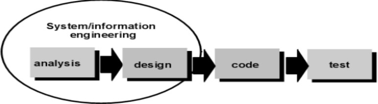

> **Figure 3.4:** SDLC Model

#### Requirement Analysis and Definition:

> At this stage the system features, constraints and objectives are
> determined through consultation with system users. All of these will
> be specified in detail and function as system specifications. The way
> to do this is to collect the complete requirements and then analyze
> and define the needs that must be met by the program to be built. This
> phase must be done in full to be able to produce an accurate design.

#### System and Software Design:

> In the System and Software Design Phase, a system architecture will be
> formed based on established requirements. in addition, identification
> and depiction of the basic abstraction of the software system and its
> relationships are carried out. The design is done after the complete
> requirements are collected in full.

#### Implementation and Unit Testing:

> In this Implementation and Unit Testing phase, the results of the
> software design will be realized as a set of programs or program
> units. Program design is translated into codes using predetermined
> programming languages. The pro- gram built by each unit will be tested
> if it meets the specifications.

#### Integration and System Testing:

> In this Integration and System Testing phase, each program unit will
> be integrated with each other and tested as a whole system to ensure
> that the system meets existing requirements.

#### Operation and Maintenance:

> In this Operation and Maintenance stage, the system is installed and
> put into use. It also corrects errors that are not found at the
> manufacturing stage. In this stage, system development is also carried
> out such as the addition of new features and functions.
>
> **Chapter 4**

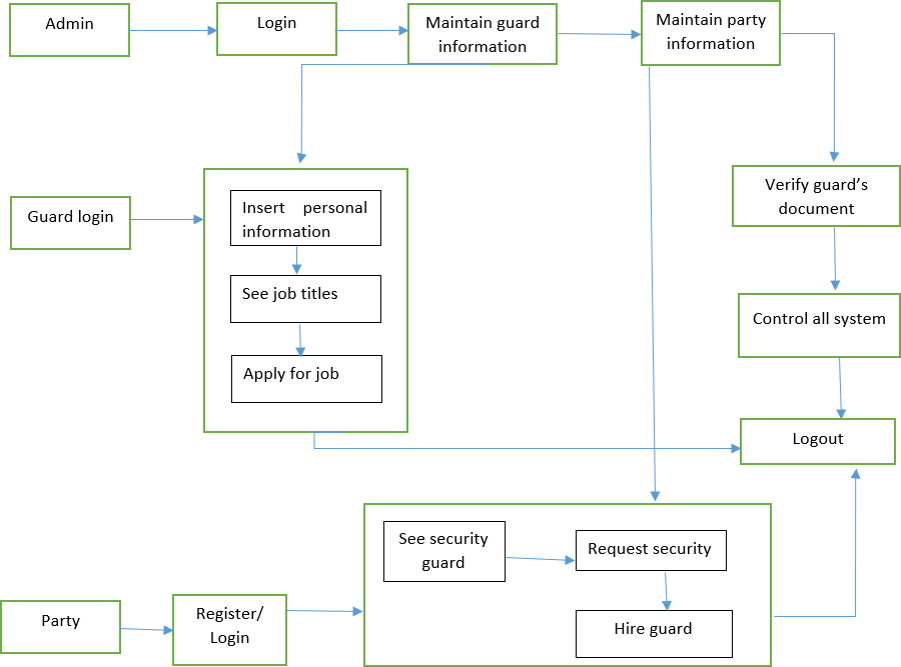

> **SYSTEM DESIGN**

**System Architecture**
-----------------------

> Figure 4.1: System Architecture Diagram of Project
>
> 22

System Architecture Description
-------------------------------

> The architecture of the Online Labour Hiring System is designed to
> ensure seamless interaction between users and system components. It
> follows a client server model with a centralized database for secure
> data storage and management. At the front end, users (both labour
> seekers and labour) interact with the system through a webbased
> interface developed using HTML, CSS, and possibly JavaScript. This
> interface communicates with the backend server, built in Python, which
> handles logic processing, authentication, and data management. The
> backend is connected to an SQLite database that stores user
> credentials, labour profiles, job postings, bookings, and feedback.
> When a user logs in or registers, the request is processed by the
> Python-based backend, which retrieves or stores data in the database.
> Admins can manage user data and oversee system operations. The system
> ensures secure role based access for administrators, clients, and
> labourers, maintaining data integrity and operational
> transparency. This layered structure improves maintainability,
> scalability, and efficiency, ensuring a responsive and reliable
> experience for all types of users.

**Details of each module**
--------------------------

> The architecture of the Online Labour Hiring System is designed to
> ensure seamless interaction between users and system components.

-   #### **User Registration and Authentication Module:**

> This module allows both clients and labour to register on the
> platform. It collects necessary details such as name, contact
> information, and verification documents. The authentication system
> ensures secure login using email and password, and optionally supports
> password recovery.

-   **Admin Module:**

> The admin has complete control over the platform. This module allows
> admins to verify user profiles, approve or reject labour
> registrations, manage user accounts, handle complaints, and generate
> reports. Admins can also monitor system activity to ensure compliance
> and efficiency.

-   **Labour Profile Management Module :**This module enables labour to
    create and manage their profiles, including experience,
    availability, location preferences, and skill certifications. It
    also allows them to view and apply for jobs that match their
    qualifications.

-   **Job Posting and Search Module :**

> Clients can post requirements for labour services, specifying the
> location, timing, duration, and any specific skills required. Labour
> can search and apply for suitable jobs. This module includes smart
> filtering based on availability, proximity, and qualifications.

-   **Booking and Hiring Module** Once a client selects a labour , this
    module facilitates the hiring process. It includes job confirmation,
    scheduling, communication tools, and service history. This module
    ensures that both parties can manage the job status and track
    service periods.

-   **Feedback and Rating Module:** After the completion of a job, both
    the client and the labour can rate and review each other. This
    feedback system builds trust and helps future users make informed
    decisions based on service quality.

-   **Notification Module** This module sends alerts and notifications
    via email or in app messages for new job posts, application
    approvals, status updates, and reminders. It ensures smooth
    communication and real time updates for all users.

    1.  Data Flow Diagrams
        ------------------

> A data flow diagram (DFD) is a graphical or visual representation
> using a standardized set of symbols and notations to describe a
> business's operations through data movement. They are often elements
> of a formal methodology such as Structured Systems Analysis and Design
> Methods.
>
> The objective of a DFD is to show the scope and boundaries of a system
> as a whole. It may be used as a communication tool between a system
> analyst and any person who plays a part in the order that acts as a
> starting point for redesigning a system. The DFD is also called as a
> data flow graph or bubble chart.
>
> DFD 0, also called context diagram of the result management system. As
> the bubbles are decomposed into less and less abstract bubbles, the
> corresponding data flow may also be needed to be decomposed.

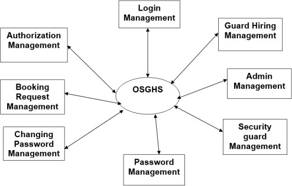

> **Figure 4.2:** DFD 0 Diagram
>
> DFD 1, a context diagram is decomposed into multiple
> bubbles/processes. In this level, we highlight the main objectives of
> the system and breakdown the high- level process of 0-level DFD into
> subprocesses.

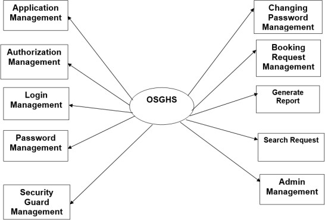

> **Figure 4.3:** DFD 1 Diagram
>
> 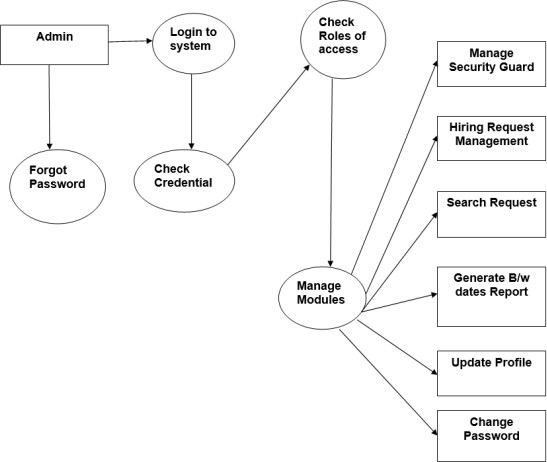
>
> **Figure 4.4:** DFD 2 Diagram

**ER Diagrams**
---------------

> An entity relationship diagram (ERD), also known as an entity
> relationship model, is a graphical representation that depicts
> relationships among people, ob- jects, places, concepts or events
> within an information technology (IT) system.
>
> Depending on the scale of change, it can be risky to alter a database
> structure directly in a DBMS. To avoid ruining the data in a
> production database, it is important to plan out the changes
> carefully. ERD is a tool that helps. By drawing ER diagrams to
> visualize database design ideas, you have a chance to identify the
> mistakes and design flaws, and to make corrections before executing
> the changes in the database.

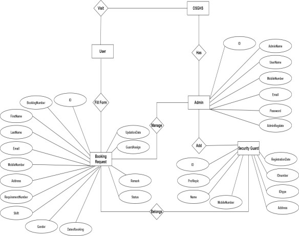

> **Figure 4.5:** ER Diagram

3.  **UML Diagram**
    ---------------

    1.  ### **Activity Diagram**

> Use cases show what your system should do. Activity diagrams allow you
> to specify how your system will accomplish its goals. Activity
> diagrams show high- level actions chained together to represent a
> process occurring in your system. An activity diagram is essentially a
> flowchart, showing flow of control from activity to activity. Unlike a
> traditional flowchart, an activity diagram shows concurrency as well
> as branches of control. Activity diagrams focus on the dynamic flow of
> a system.
>
> 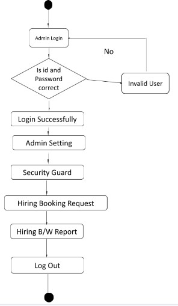
>
> **Figure 4.6:** Activity Diagram of e-Tendering System

### **Sequence Diagram**

> The sequence diagram is used primarily to show the interactions
> between objects in the sequential order that those interactions occur.
> Developers typically think sequence diagrams were meant exclusively
> for them. However, an organization's business staff can find sequence
> diagrams useful to communicate how the business currently works by
> showing how various business objects interact .Sequence diagrams
> illustrate how objects interact with each other. They focus on message
> sequences, that is, how messages are sent and received between a
> number of objects. The main purpose of sequence diagram is to show the
> order of events between the parts of system that are involved in
> particular interaction.

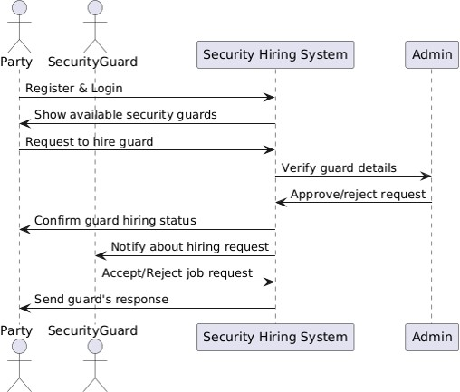

> **Figure 4.7:** Sequence Diagram

### **Use Case Diagram**

> Four modeling elements make up the use case diagram; these are:

-   **Actors:** Actors refer to a type of users, users are people who
    use the system. In this case student, teacher developer are the
    users of the framework and application

-   **Use cases:** A use case defines behavioral features of a system.
    Each use case is named using a verb phrase that express a goal of
    the system. The name may appear inside or outside the ellipse.

-   **Associations:** An association is a relationship between an actor
    and a use case. The relationship is represented by a line between an
    actor and a use case.

-   **The include relationship:** It is analogous to a call between
    objects. One use case requires some type of behavior which is fully
    defined in another use case.

> 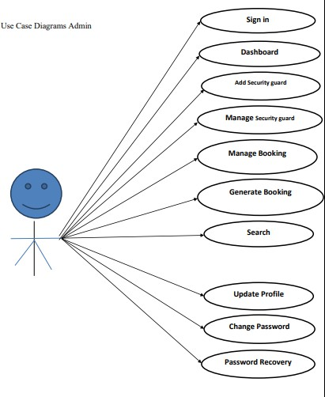
>
> **Figure 4.8:** Usecase Diagram

### Class Diagram

> The class diagram shows the building blocks of any object oriented
> system. Class diagram depicts a static view of the model or part of
> the model, describing what attributes and behavior it has rather that
> the detailing the methods of achieving operations. Class diagrams are
> most useful in illustrating relationships between classes and
> interfaces. Generalizations, aggregations, and associations are all
> valuable in reflecting interface, composition or usage and connections
> receptively.
>
> The Figure 6.2 illustrates aggregation relationships between classes.
> The lighter aggregation indicates that the class Object Explorer used
> Thumb Nail, but does not necessarily contain an instance of it. The
> strong, composite aggregations by the other connectors indicate
> ownership or containment of the source classes by the target. Class,
> for example Video Player values will be contained in Table Of
> Contents.
>
> 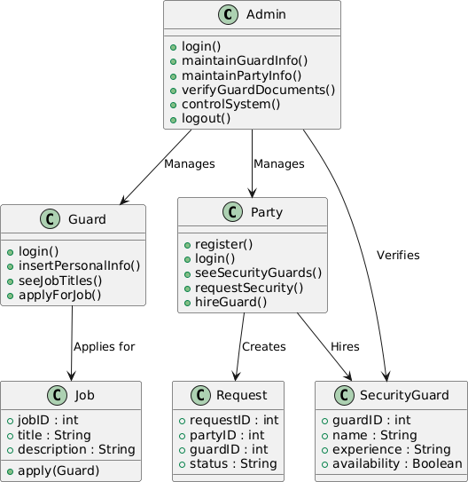
>
> **Figure 4.9:** Class diagram
>
> **EXPERIMENTAL CONFIGURATION**

Tools and Technology used
-------------------------

> The Online Labour Hiring System is developed as a web-based
> application, enabling users to access the platform through any
> standard web browser without the need for installing additional
> software. This approach ensures maximum accessibility and convenience,
> allowing clients, labour agencies, and workers to interact with the
> system from any location using various devices such as desktops,
> laptops, tablets, or smartphones. The centralized nature of the web
> application al- lows all data such as user profiles, job listings, and
> applications to be stored on a central server, making updates and
> management seamless. With real time communication capabilities, users
> can instantly receive notifications, post vacancies, or apply for
> jobs. The system is also designed to be secure, incorporating user
> authentication and data privacy measures. Moreover, it offers
> flexibility and scalability, ensuring it can adapt to increasing user
> demands and support future enhancements like payment integration or
> background verification modules.
>
> **SOFTWARE TESTING**

Introduction
------------

> Software testing is an activity aimed at evaluating an attribute or
> capability of a program or system and determining that it meets its
> required results. It is more than just running a program with the
> intention of finding faults. Every project is new with different
> parameters. No single yardstick maybe applicable in all circumstances.
> This is a unique and critical area with altogether different problems.
> Although critical to software quality and widely deployed by programs
> and testers. Software testing steel remains an art, due to limited
> understanding of principles of software. The difficulty stems from
> complexity of software. The purpose of software testing can be quality
> assurance, verification and validation or reliability estimation.
> Software testing is a trade-off between budget,time and quality. In
> this chapter there is relevant explanation on testing strategies use
> to test the system, and test cases.

Types of Testing
----------------

> Testing Strategy used for testing the system are as follows,

1.  Manual Testing

2.  Automated Testing

3.  Unit Testing

4.  Integration Testing

5.  Regression Testing

    1.  ### Manual Testing

> Manual and Automated test are the types of software testing. We are
> doing a manual test for testing our system that is without using any
> automated tool or any script. In this type tester takes over the role
> of an end user and test the software to identify any unexpected
> behavior or bug. There are different stages for manual testing like
> unit testing, integration testing, system testing and user acceptance
> testing. Testers use test plan, test cases or test scenario to test
> the software to ensure the completeness of a testing. Manual testing
> also includes exploratory testing as a testers explore the software to
> identify the errors in it.

### Automated Testing

> Automation testing which is also known as Test Automation is when the
> tester writes scripts and uses software to test the software. This
> process involves automation of a manual process. Automation testing is
> used to re-run the test scenarios that were performed manually,
> quickly and repeatedly.

### Unit Testing

> In case of unit testing, each software component, software modules or
> soft- ware subsystem is tested independent of any other components
> involved in the whole software system. That is individual software
> modules or software components are tested in unit testing. The main
> agenda behind unit testing is to verify and validate each and every
> unit of the software system by checking its working and performance
> and comparing it with the software specification. The significant
> control paths are tested and verified to discover errors within the
> boundary of the module and the component level design used for the
> same.

### Integration Testing

> Integration testing is a kind of testing meant for building the
> software architecture along with finding out the errors related with
> the interfacing. After successful execution of unit testing, software
> subsystem will be collected together and combined together in order to
> build the whole software system as it is specified and define at high
> level design. Facial Emotion Recognition Using Convolutional Neural
> Network Integration testing is an efficient procedure for verification
> of the structure
>
> of a software system and validation of order of execution of software
> system while conducting tests to determine errors allied with
> interfacing.

### Regression Testing

> During the software development procedure, whenever the software
> system is modified by means of editing, removing, adding source code,
> software developers need to be sure that the new version of the
> software is good as earlier version. Tests that focus on the software
> modules that have been modified or altered and focus on overall
> functionality of the software system when the software functions are
> likely to be affected by the modifications or change.

Software testing
----------------

> Software testing can also provide an objective, independent view of
> the software to allow the business to appreciate and understand the
> risks of software implementation. Test techniques include the process
> of executing a program or application with the intent of finding
> software bugs (errors or other defects), and verifying that the
> software product is fit for use. Software testing involves the
> execution of a soft- ware component or system component to evaluate
> one or more properties of interest. In general, these properties
> indicate the extent to which the component or system under test:

-   Meets the requirements that guided its design and development,

-   Responds correctly to all kinds of inputs,

-   Performs its functions within an acceptable time,

-   It is sufficiently usable,

-   Can be installed and run in its intended environments, and

-   Achieves the general result its stakeholders desire.

> As the number of possible tests for even simple software components is
> practically infinite, all software testing uses some strategy to
> select tests that are feasible for the available time and resources.
> As a result, software testing typically (but not exclusively) attempts
> to execute a program or application with the intent of finding
> software bugs (errors or other defects). The job of testing is an
> iterative process as when one bug is fixed, it can illuminate other,
> deeper bugs, or can even create new ones.

Black Box Testing
-----------------

> This testing methodology looks at what are the available inputs for an
> application and what the expected outputs are that should result from
> each input. It is not concerned with the inner workings of the
> application, the process that the application undertakes to achieve a
> particular output or any other internal aspect of the application that
> may be involved in the transformation of an input into an output. Most
> black-box testing tools employ either coordinate based interaction
> with the applications graphical user interface (GUI) or image
> recognition. An example of a black-box system would be a search
> engine. You enter text that you want to search for in the search bar,
> press "Search" and results are returned to you. In such a case, you do
> not know or see the specific process that is being employed to obtain
> your search results, you simply see that you provide an input -- a
> search term -- and you receive an output your search results.

### Black-box

> There are many advantages to black-box testing. Here are a few of the
> most commonly cited:

1.  **Ease of use:** Because testers do not have to concern themselves
    with the inner workings of an application, it is easier to create
    test cases by simply working through the application, as would an
    end user.

2.  **Quicker test case development:** Because testers only concern
    themselves with the GUI, they do not need to spend time identifying
    all of the internal paths that may be involved in a specific
    process, they need only concern themselves with the various paths
    through the GUI that a user may take.

3.  **Simplicity:** Where large, highly complex applications or systems
    exist black- box testing offers a means of simplifying the testing
    process by focusing on valid and invalid inputs and ensuring the
    correct outputs are received.

> But, for all of the benefits of black-box testing, many attempts to
> create black-box test systems resulted in several drawbacks that
> caused people to question the via- bility of the black-box approach.
>
> Some of the most commonly cited issues were:

1.  **Script maintenance:** While an image-based approach to testing is
    useful, if the user interface is constantly changing the input may
    also be changing. This makes script maintenance very difficult
    because black-box tools are reliant on the method of input being
    known.

2.  **Fragility:** Interacting with the GUI can also make test scripts
    fragile. This is because the GUI may not be rendered consistently
    from time to time on different platforms or machines. Unless the
    tool is capable of dealing with differences in GUI rendering, it is
    likely that test scripts will fail to execute properly on a
    consistent basis.

3.  **Lack of introspection:** Ironically, one of the greatest criticism
    of black-box testing is that it isn't more like white-box testing;
    it doesn't know how to look in- side an application and therefore
    can never fully test an application or system. The reasons cited for
    needing this capability are often to overcome the first two issues
    mentioned. The reality is quite different.

    1.  White Box Testing
        -----------------

> This testing methodology looks under the covers and into the subsystem
> of an application. Whereas black-box testing concerns itself
> exclusively with the inputs and outputs of an application, white-box
> testing enables you to see what is happening inside the application.
> White box testing provides a degree of sophistication that is not
> available with black-box testing as the tester is able to refer to and
> interact with the objects that comprise an application rather than
> only having access to the user interface. An example of a white-box
> system would be in-circuit testing where someone is looking at the
> interconnections between each component and verifying that each
> internal connection is working properly. Another example from a
> different field might be an auto-mechanic who looks at the
> inner-workings of a car to ensure that all of the individual parts are
> working correctly to ensure the car drives properly.

### White-box

> Like black-box testing, there are distinct advantages to white-box
> testing. Here are a few of the most commonly cited:

1.  **Introspection:** Introspection, or the ability to look inside the
    application, means that testers can identify objects
    programmatically. This is helpful when the GUI is changing
    frequently or the GUI is yet unknown as it allows testing to pro-
    ceed. It also can, in some situations, decrease the fragility of
    test scripts provided the name of an object does not change.

2.  **Stability:** In reality, a by-product of introspection, white-box
    testing can de- liver greater stability and reusability of test
    cases if the objects that comprise an application never change.

3.  **Thoroughness:** In situations where it is essential to know that
    every path has been thoroughly tested, that every possible internal
    interaction has been exam- ined, white-box testing is the only
    viable method.

> As such, white-box testing offers testers the ability to be more
> thorough in terms of how much of an application they can test. Despite
> these benefits, white-box testing has its drawbacks.
>
> Some of the most commonly cited issues are:

1.  **Complexity:** Being able to see every constituent part of an
    application means that a tester must have detailed programmatic
    knowledge of the application in or- der to work with it properly.
    This high-degree of complexity requires a much more highly skilled
    individual to develop test case.

2.  **Fragility:** While introspection is supposed to overcome the issue
    of application changes breaking test scripts the reality is that
    often the names of objects change during product development or new
    paths through the application are added. The fact that white-box
    testing requires test scripts to be tightly tied to the underlying
    code of an application means that changes to the code will often
    cause white-box test scripts to break. This, then, introduces a high
    degree of script maintenance into the testing process.

3.  **Integration:** For white-box testing to achieve the degree of
    introspection re- quired it must be tightly integrated with the
    application being tested. This creates a few problems. To be tightly
    integrated with the code you must install the white-box tool on the
    system on which the application is running. This is okay, but where
    one wishes to eliminate the possibility that the testing tool is
    what is causing either a performance or operational problem, this
    becomes impossible to resolve. Another issue that arises is that of
    platform support. Due to the highly integrated nature of white-box
    testing tools many do not provide support for more than one
    platform, usually Windows®. Where companies have applications that
    run on other plat- forms, they either need to use a different tool
    or resort to manual testing.

    1.  Test cases
        ----------

> **Table 6.1:** Test cases

+--------+----------------------------+-----------------------------+
| > Task | > Description              | > Action                    |
+========+============================+=============================+
| > 001  | > System accessible to the | > User should open System   |
|        | >                          | > from                      |
|        | > user                     | >                           |
|        |                            | > PC                        |
+--------+----------------------------+-----------------------------+
| > 002  | > Login page               | > The login page is         |
|        |                            | > displayed on              |
|        |                            | >                           |
|        |                            | > System                    |
+--------+----------------------------+-----------------------------+
| > 003  | > New Registration         | > new user register with    |
|        |                            | > name,                     |
|        |                            | >                           |
|        |                            | > email ID and password     |
+--------+----------------------------+-----------------------------+
| > 004  | > user Login               | > user should log in first  |
|        |                            | > by entering a username    |
|        |                            | > and                       |
|        |                            | >                           |
|        |                            | > password                  |
+--------+----------------------------+-----------------------------+
| > 005  | > Authentication           | > if username and password  |
|        |                            | > are valid then only       |
|        |                            | > system will display the   |
|        |                            | > page of "Online           |
|        |                            | >                           |
|        |                            | > Labour Hub Hiring     |
|        |                            | > System"                   |
+--------+----------------------------+-----------------------------+
| > 006  | > Dataset                  | > we create the dataset for |
|        |                            | > system and trained the    |
|        |                            | > system and create model   |
|        |                            | > for analyzing the         |
|        |                            | >                           |
|        |                            | > voter information.        |
+--------+----------------------------+-----------------------------+
| > 007  | > Apply vote               | > voter can cast a vote by  |
|        |                            | > selecting                 |
|        |                            | >                           |
|        |                            | > the candidate.            |
+--------+----------------------------+-----------------------------+
| > 008  | > Processing               | > Here we will do the       |
|        |                            | > process of                |
|        |                            | >                           |
|        |                            | > voting and save it with   |
|        |                            | > the dataset trained       |
|        |                            | > model.                    |
+--------+----------------------------+-----------------------------+
| > 009  | > Display                  | > System will display the   |
|        |                            | > vote is                   |
|        |                            | >                           |
|        |                            | > successfully placed or    |
|        |                            | > not.                      |
+--------+----------------------------+-----------------------------+

**Test Results**
----------------

> **Table 6.3:** Test Results

+-----------+--------------+--------------+--------------+----------+
| > Test ID | >            | > Expected   | > Actual     | > Status |
|           |  Description | > Result     | > Result     |          |
+===========+==============+==============+==============+==========+
| > 001     | > To check   | > User       | > User has   | > PASS   |
|           | > whether    | > should     | >            |          |
|           | >            | >            | successfully |          |
|           | > user       | >            | > connected  |          |
|           | >            | successfully | > in network |          |
|           | successfully | > connected  |              |          |
|           | > connected  | > in network |              |          |
|           | > in network |              |              |          |
+-----------+--------------+--------------+--------------+----------+
| > 002     | > User Login | > User       | > User has   | > PASS   |
|           |              | > should     | > logged in  |          |
|           |              | > Login in   | >            |          |
|           |              | >            | > system     |          |
|           |              | > system     |              |          |
+-----------+--------------+--------------+--------------+----------+
| > 003     | > Data store | > System     | > System has | > PASS   |
|           | > in         | > should     | > store      |          |
|           | >            | > store      | >            |          |
|           | > database   | >            | > values in  |          |
|           |              | > values in  | > database   |          |
|           |              | > database   |              |          |
+-----------+--------------+--------------+--------------+----------+
| > 004     | > Incorrect  | > If user    | > System has | > PASS   |
|           | > Data       | > gives      | > shown      |          |
|           |              | > wrong      | > error      |          |
|           |              | >            |              |          |
|           |              | > values     |              |          |
|           |              | > ,system    |              |          |
|           |              | > should     |              |          |
|           |              | > show error |              |          |
+-----------+--------------+--------------+--------------+----------+
| > 005     | > System     | > System     | > System     | > PASS   |
|           | >            | > should     | > able       |          |
|           |  performance | >            | > perform as |          |
|           |              | > perform as | > per        |          |
|           |              | > per        | >            |          |
|           |              | >            | requirements |          |
|           |              | requirements |              |          |
+-----------+--------------+--------------+--------------+----------+
| > 006     | > Connection | > System     | > System is  | > PASS   |
|           | > to network | > should     | > connected  |          |
|           | > data       | > able to    | > to network |          |
|           | > protocol   | > connect to | > protocol   |          |
|           |              | > network    |              |          |
|           |              | >            |              |          |
|           |              | > protocol   |              |          |
+-----------+--------------+--------------+--------------+----------+
| > 007     | > Delay time | > System     | > System is  | > PASS   |
|           | >            | > should     | > giving     |          |
|           | > management | > give       | >            |          |
|           |              | >            | > quick      |          |
|           |              | > quick      | > response   |          |
|           |              | > response   | > to         |          |
|           |              | > to         |              |          |
+-----------+--------------+--------------+--------------+----------+
| > 008     | >            | > System     | > System is  | > PASS   |
|           | Notification | > should     | > giving     |          |
|           | > to user on | > able to    | >            |          |
|           | > display    | > give       | notification |          |
|           |              | >            | > to user on |          |
|           |              | notification | >            |          |
|           |              | > to         | > display    |          |
|           |              | >            |              |          |
|           |              | > user on    |              |          |
|           |              | > display    |              |          |
+-----------+--------------+--------------+--------------+----------+
| > 009     | > System     | > System     | > System     | > PASS   |
|           | > Accuracy   | > should     | > able to    |          |
|           |              | >            | >            |          |
|           |              | >            | > perform    |          |
|           |              |  performance | > features   |          |
|           |              | > features   | > with       |          |
|           |              | > with       | > accuracy   |          |
|           |              | > accuracy   |              |          |
+-----------+--------------+--------------+--------------+----------+
| > 010     | > System     | > should     | > System is  | > PASS   |
|           | > output     | > give all   | > give all   |          |
|           | > test       | > the output | > the output |          |
|           | > System     | > as per     | > as per     |          |
|           |              | >            | >            |          |
|           |              | >            | >            |          |
|           |              |  programming |  programming |          |
+-----------+--------------+--------------+--------------+----------+

> **Chapter 7**
>
> **EXPERIMENTAL RESULTS**

**Screen shots**
----------------


> 46
>
> 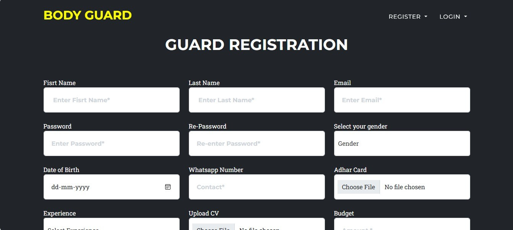

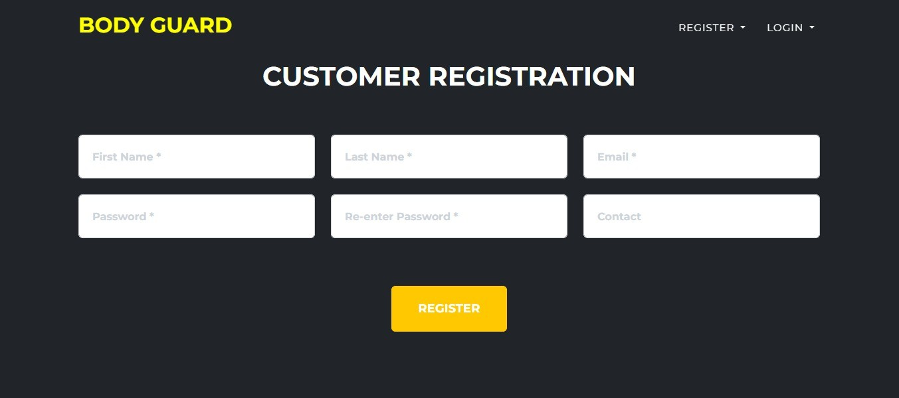

> 


> 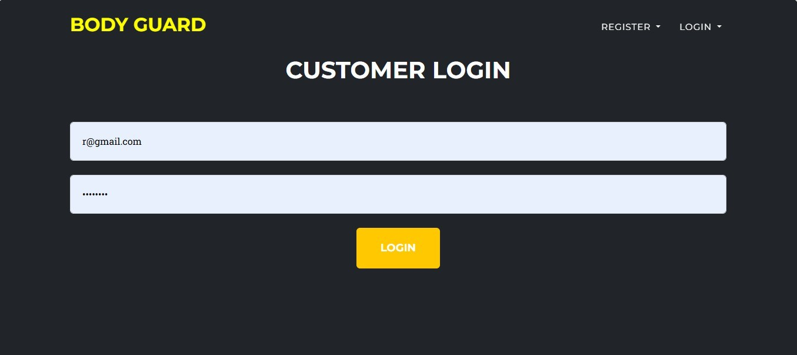

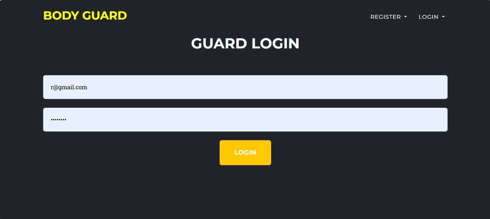

> 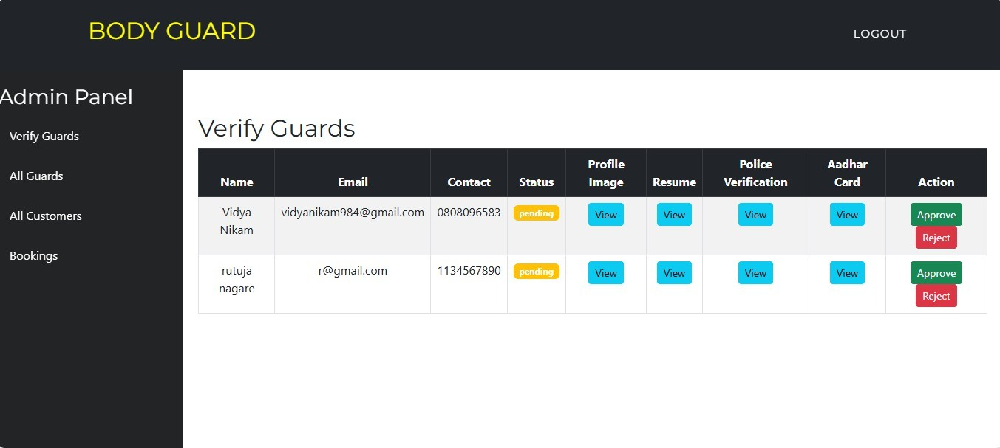

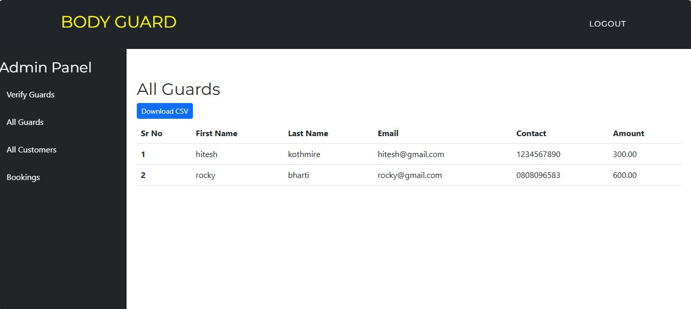

> 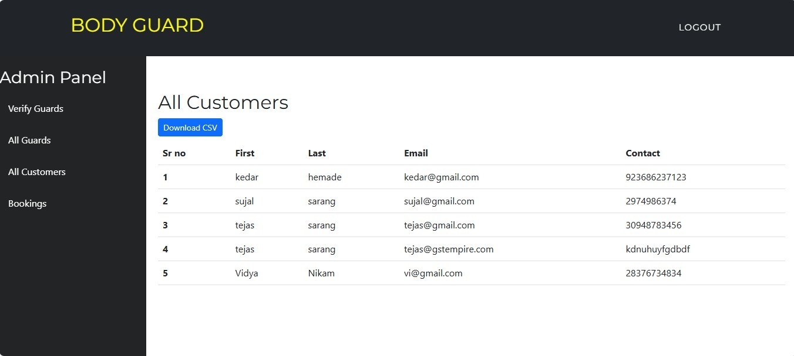

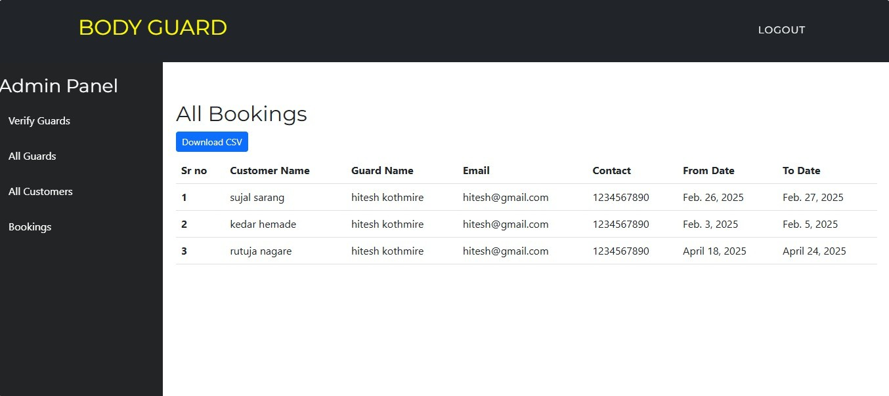

> 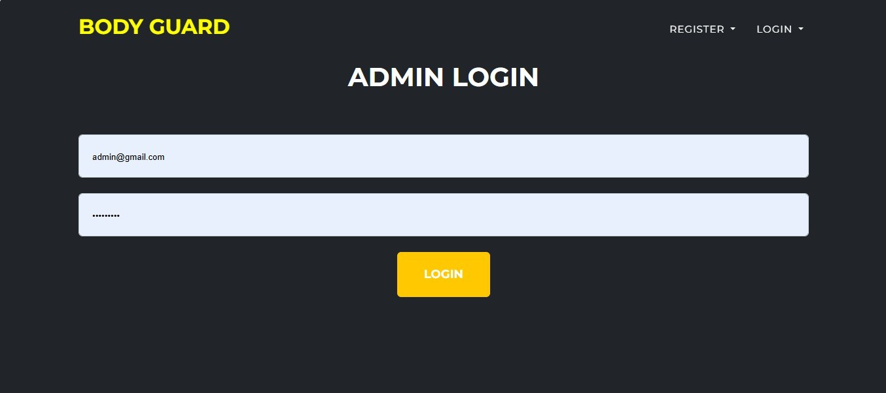
>
> **Chapter 8**
>
> **OTHER SPECIFICATION**

1.  **Advantages**
    --------------

    1.  Users can access the platform anytime and from anywhere using a
        device with an internet connection.

    2.  Automates the traditional labour hiring process, reducing the
        time needed for recruitment and verification.

    3.  Clients and labour receive instant notifications for bookings,
        job status, and application approvals.

    4.  Ratings, reviews, and job history make the system more
        transparent, helping users make informed decisions.

    5.  Simple and intuitive design makes it easy for all users to
        navigate, even without technical knowledge.

    6.  Labour are verified through uploaded documents and admin
        approval, enhancing trust and reliability.

    7.  Admins can monitor and manage all users, postings, and feedback
        from a central dashboard.

    8.  Reduces the need for paper based applications and manual
        processes, promoting a greener solution.

> 53
>
> Online Labour Hub Hiring System

2.  **Applications**
    ----------------

    1.  Residential Apartments and Housing Societies: For managing entry
        labour and monitoring visitors.

    2.  Corporate Offices and Business Parks: To ensure the operational efficiency of
        staff, assets, and premises.

    3.  Educational Institutions: To secure campuses, monitor gates, and
        manage event labour.

    4.  Event Management Companies: To hire workers for concerts,
        exhibitions, and large gatherings.

    5.  Hospitals and Healthcare Facilities: To control access points
        and ensure the operational efficiency of patients and staff.

    6.  Banks and Financial Institutions: For round-the-clock labour
        of highly sensitive areas.

    7.  Government Buildings and Public Offices: To regulate and reliable
        labour public access and internal operations.

    8.  Labour Agencies: To manage their labour workforce, job
        assignments, and client communications.

> 54
>
> SND POLYTECHNIC YEOLA- Computer Engineering
>
> **Chapter 9**
>
> **CONCLUSION**
>
> The Online Labour Hiring System offers a smart, efficient, and re-
> liable solution to modern day labour staffing challenges. By
> digitizing the entire hiring process, it bridges the gap between
> labour service providers and clients, enabling real-time
> communication, seamless bookings, and verified personnel deployment.
> The system enhances transparency, saves time and resources, and
> ensures that both clients and labourers benefit from a
> streamlined and trustworthy platform. With features like real time
> updates, secure login, profile management, and feedback mechanisms,
> this web based application not only improves user experience but also
> promotes accountability and professionalism in the labour sector. As
> technology continues to evolve, such systems play a crucial role in
> shaping safer and more connected communities.

1.  Mobile and Web-Based Labour Working, Monitoring and Reporting
    System to Maintain Efficient and Productive Environment at Premises:V.R.
    Gannapa- thy. 07-09 September 2022
    https://ieeexplore.ieee.org/document/9896606.

2.  Event Management Systems (EMS), Drahsti Amrish Shah 18-20
    December 2022. https://ieeexplore.ieee.org/document/10074832

3.  Event Management System, Vinay Mishra 20-22 October 2021
    https://ieeexplore.ieee.org/document/9633388

4.  Web-Based College Event Management Platform, Bhagyashree Patil,
    Shruti Rawool, Ayushi Sagar, Prof.Sudhakar Yerme 13 June 2005
    https://ieeexplore.ieee.org/document/1437050

    1.  **Relevant Mathematics associated with the Project**
        ----------------------------------------------------

####  **System Description:**

> S= System S I , O , F
>
> Where
>
> I = Inputs
>
> O = Outputs F = Functions
>
> I = SB , L , R
>
> Where
>
> SB = Labour Book L = Login
>
> R = Register
>
> O = VSB
>
> Where
>
> VSB = Verified Labour Booking
>
> F = A , BC
>
> Where
>
> A = Authentication
>
> BC = Background Check
>
> 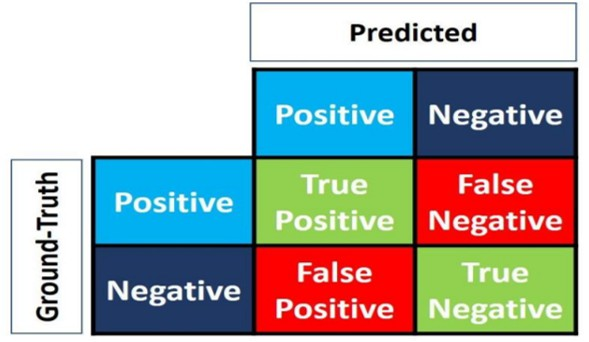
>
> False Positive Negative
>
> The 4 elements of matrix (the items in red and green) represent the 4
> metrics that count the number of correct and incorrect predictions the
> model made. Each element is given by a label that consist of two
> words:

####  **Precision**

> The precision is calculated as the ratio between the number of
> positive samples correctly classified to the number of samples
> classified as Positive (either correctly or incorrectly). The
> precision measures the model's accuracy in classifying a sample as
> positive.


> Fig: Precision Formula

####  **Recall**

> The recall is calculated as the ratio between the number of Positive
> samples correctly classified as Positive to the total of Positive
> samples. The recall measures the model's ability to detect Positive
> samples. The higher the recall, the more positive samples detected.


> Fig: Recall Formula

 Appendix B
==========

 Paper Publication Certificates
==============================

> 60
